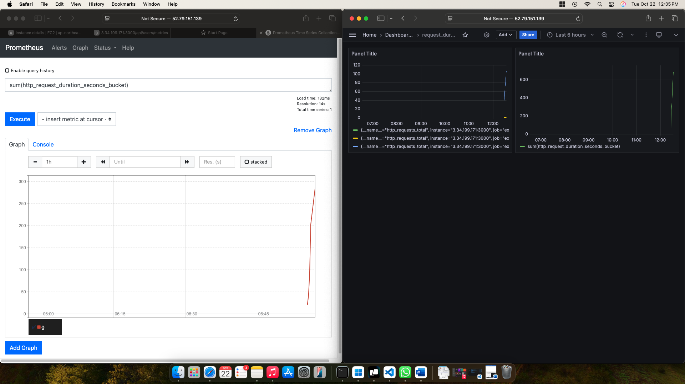
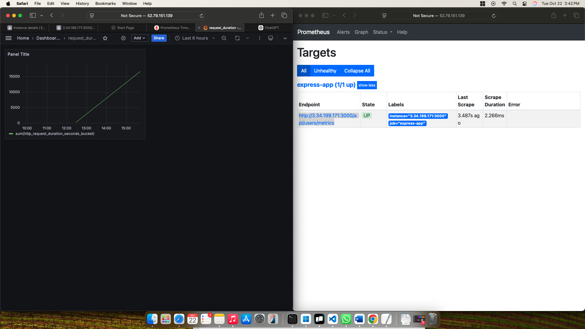
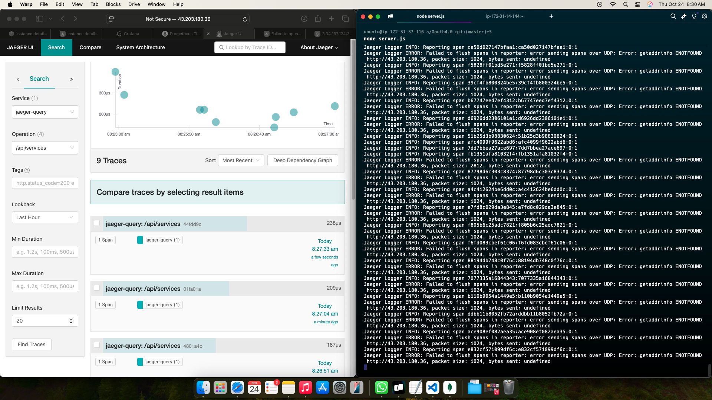
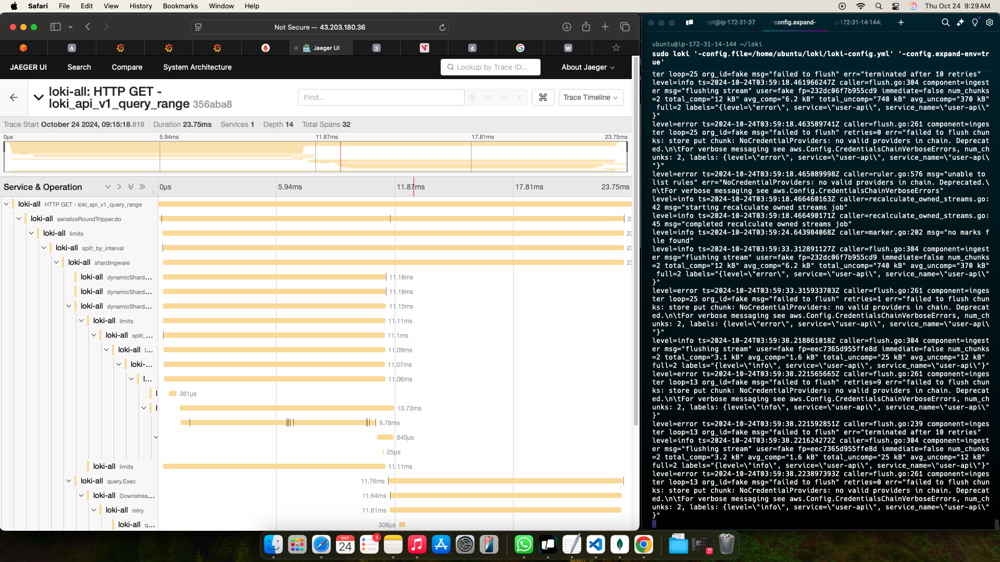

# OAuth V4

This is in SSO ( single sign on ) Mainly used in Large scale organisations to avoid breach, duplication of account and an eco system of security sandbox to make easy to it's users to have safe access to application login 

## Overview

This project is based on Authentication and Authorisation that provides [brief description of the microservice functionality]. The service is monitored using Prometheus for metrics collection and Grafana for visualization.

## Architecture

- **Microservice**: Deployed in a single instance.
- **Prometheus**: Scrapes metrics from the microservice.
- **Grafana**: Visualizes metrics collected by Prometheus.
- **Loki**: Aggregates the Metrics collected. 

## Requirements

- Two instances 
- **Application Instance** : To Deploy the application 
- **Monitoring Intance** : To monitor application metrics

## Deployment

To deploy the microservice along with Prometheus and Grafana, follow these steps:

- Deploy Monitoring instance and install Grafana, Prometheus in a instance 
- Deploy Webapplication in *Application Instance make sure to add mongo URI in .env File 

## Monitoring

### Prometheus Configuration
```
global:
  scrape_interval: 15s

scrape_configs:
  - job_name: 'oauth-service'
    static_configs:
      - targets: ['http://3.34.199.171:3000/api/users/metrics:3000']

```

## Jaeger Metrics Hosting 

```
# Command to run Jaeger using docker 

sudo docker run -d --name jaeger \
  -e COLLECTOR_ZIPKIN_HOST_PORT=:9411 \
  -p 5775:5775/udp \
  -p 6831:6831/udp \
  -p 6832:6832/udp \
  -p 5778:5778 \
  -p 16686:16686 \
  -p 14250:14250 \
  -p 14268:14268 \
  -p 14269:14269 \
  -p 9411:9411 \
  jaegertracing/all-in-one:1.22
```

### Usage

| Endpoint                | Method | Description                      |
|-------------------------|--------|----------------------------------|
| `/api/login`            | POST   | Authenticates a user             |
| `/api/register`         | POST   | Registers a new user             |
| `/api/users/metrics`    | GET    | Retrieves metrics for monitoring |
| `/api/users/`           | GET    | Returns Hello World Image        |

## Deployment Images 

### Monitoring and Visualisation 



### Deployment



### Jaeger Metrics



### Deepdive metrics 



npm install express serverless-http cors jaeger-client prom-client winston winston-loki opentracing morgan bcryptjs node-os-utils express-rate-limit mongoose