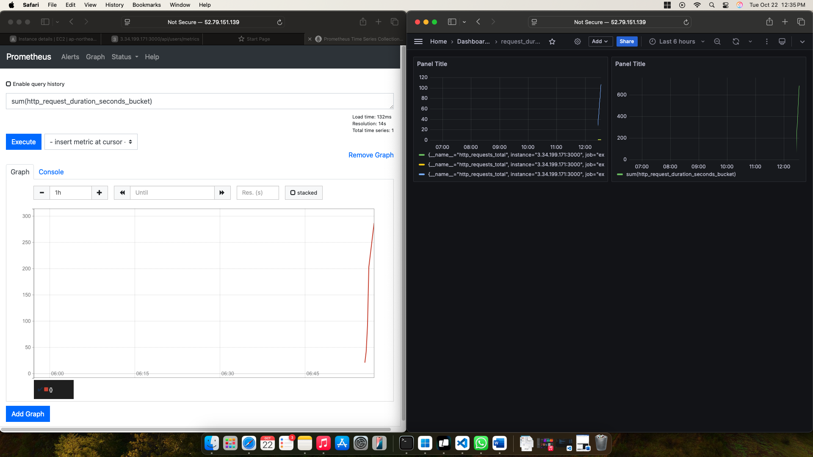
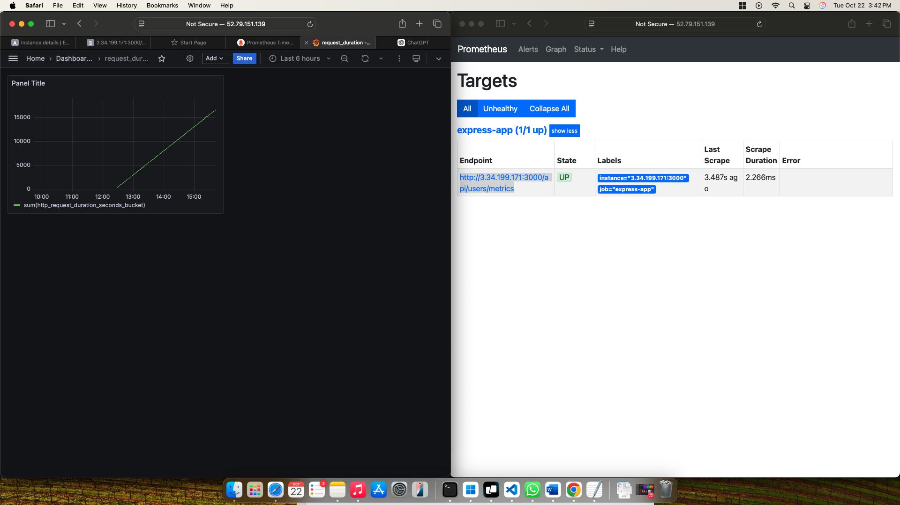
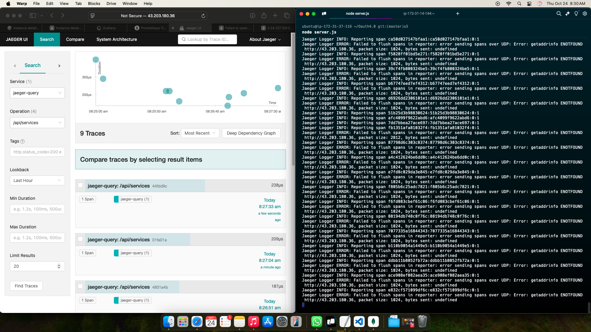
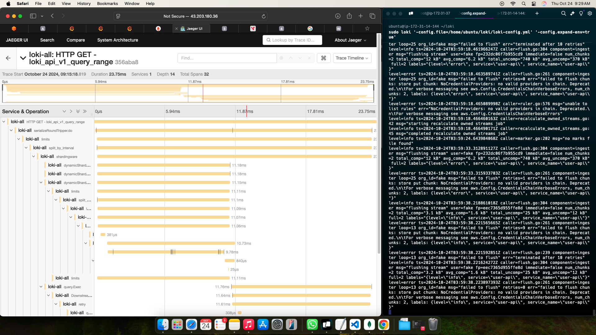

# OAuth V4

This is in SSO ( single sign on ) Mainly used in Large scale organisations to avoid breach, duplication of account and an eco system of security sandbox to make easy to it's users to have safe access to application login 

## Overview

This project is based on Authentication and Authorisation that provides [brief description of the microservice functionality]. The service is monitored using Prometheus for metrics collection and Grafana for visualization.

## Architecture

- **Microservice**: Deployed in a single instance.
- **Prometheus**: Scrapes metrics from the microservice.
- **Grafana**: Visualizes metrics collected by Prometheus.
- **Loki**: Aggregates the Metrics collected. 

## Requirements

- Two instances 
- **Application Instance** : To Deploy the application 
- **Monitoring Intance** : To monitor application metrics

## Environment Variables

Set the following in `.env` before running:

```
MONGODB_URI=<mongodb_connection_string>
JWT_ACCESS_SECRET=<long_random_secret>
JWT_REFRESH_SECRET=<long_random_secret>
ACCESS_TOKEN_TTL=15m
REFRESH_TOKEN_TTL_DAYS=7
PORTFOLIO_DEMO_TRIAL_DAYS=30
BCRYPT_ROUNDS=12
CORS_ORIGINS=http://localhost:3000
LOKI_HOST=http://49.121.3.2:3100
CORS_STRICT_ORIGIN_CHECK=false
ADMIN_BOOTSTRAP_ENABLED=true
ADMIN_BOOTSTRAP_NAME=Platform Admin
ADMIN_BOOTSTRAP_USERNAME=admin
ADMIN_BOOTSTRAP_EMAIL=admin@example.com
ADMIN_BOOTSTRAP_PASSWORD=<strong_password_12_plus_chars>
ADMIN_BOOTSTRAP_APPS=
ADMIN_BOOTSTRAP_FORCE_PASSWORD_SYNC=false
AUTH_TEST_MODE=true
BREAK_GLASS_ADMIN_TOKEN=<long_random_break_glass_token>
BREAK_GLASS_USERNAME=breakglass-admin
BREAK_GLASS_APP_ID=
ADMIN_IP_STRICT_MODE=false
ADMIN_IP_ALLOWLIST=127.0.0.1,::1
AUTH_GUARD_WINDOW_MS=300000
AUTH_GUARD_MIN_REQUESTS=20
AUTH_GUARD_MAX_FAILURE_RATE=0.45
AUTH_GUARD_COOLDOWN_MS=300000
FEATURE_PASSKEY=false
FEATURE_DPOP=false
FEATURE_RISK_ENGINE=true
FEATURE_FACE_AUTH=false
FEATURE_DEVICE_QUORUM=false
```

This service no longer ships with hardcoded apps/projects. Admin must create apps using `POST /api/users/apps` and assign them to users.

`ADMIN_BOOTSTRAP_*` creates (or upgrades) a permanent admin account at startup so you always have admin credentials for app/user management.

`LOKI_HOST` is optional. If you don’t use Loki, comment it out in `.env`:

```env
# LOKI_HOST=
```

## Deployment

To deploy the microservice along with Prometheus and Grafana, follow these steps:

- Deploy Monitoring instance and install Grafana, Prometheus in a instance 
- Deploy Webapplication in *Application Instance make sure to add mongo URI in .env File 

## Monitoring

### Prometheus Configuration
```
global:
  scrape_interval: 15s

scrape_configs:
  - job_name: 'oauth-service'
    static_configs:
      - targets: ['http://3.34.199.171:3000/api/users/metrics:3000']

```

## Jaeger Metrics Hosting 

```
# Command to run Jaeger using docker 

sudo docker run -d --name jaeger \
  -e COLLECTOR_ZIPKIN_HOST_PORT=:9411 \
  -p 5775:5775/udp \
  -p 6831:6831/udp \
  -p 6832:6832/udp \
  -p 5778:5778 \
  -p 16686:16686 \
  -p 14250:14250 \
  -p 14268:14268 \
  -p 14269:14269 \
  -p 9411:9411 \
  jaegertracing/all-in-one:1.22
```

### Usage

| Endpoint                | Method | Description                      |
|-------------------------|--------|----------------------------------|
| `/api/users/register`   | POST   | Registers a new user             |
| `/api/users/login`      | POST   | Authenticates for a specific `appId` and issues tokens  |
| `/api/users/auth/refresh` | POST | Rotates refresh token + new access token |
| `/api/users/logout`     | POST   | Revokes refresh token            |
| `/api/users/apps`       | GET    | List apps for logged-in user (admin sees all) |
| `/api/users/licenses/portfolio-demo/claim` | POST | Claim/reuse 30-day Pixel Lab demo token (auth required) |
| `/api/users/licenses/redeem` | POST | Shared redeem endpoint for trial license token issuance |
| `/api/users/licenses/me` | GET | Get current user's active trial grants |
| `/api/users/licenses/validate` | GET | Validate bearer license token (optionally for one appId) |
| `/api/users/apps`       | POST   | Create app (admin) |
| `/api/users/apps/:appId/status` | PUT | Activate/deactivate app (admin) |
| `/api/users/apps/:appId/assign/:username` | PUT | Assign app to user (admin) |
| `/api/users/apps/:appId/unassign/:username` | PUT | Remove app from user (admin) |
| `/api/users/admin/summary` | GET | Dashboard totals (admin) |
| `/api/users/admin/users` | GET | List users (admin) |
| `/api/users/admin/users/:username/apps` | GET | Get one user + assigned apps + available apps (admin) |
| `/api/users/admin/users/:username/apps` | PUT | Replace one user's app access list (admin) |
| `/api/users/admin/personal-token` | GET | List your persistent admin token(s) |
| `/api/users/admin/personal-token/rotate` | POST | Revoke old + issue new persistent admin bearer token |
| `/api/users/admin/personal-token` | DELETE | Revoke all persistent admin bearer token(s) |
| `/api/users/admin/personal-token/:tokenId` | DELETE | Revoke one persistent admin bearer token |
| `/api/users/admin/role/:username` | PUT | Set user role to `user` or `admin` |
| `/api/users/admin/safety/status` | GET | Test safety status, guard metrics, feature flags (admin) |
| `/api/users/admin/safety/reset` | POST | Reset auth rollback guard (admin) |
| `/api/users/admin/features` | GET | List active feature flags (admin) |
| `/api/users/admin/features/:featureKey` | PUT | Enable or disable one feature flag (admin) |
| `/api/users/metrics`    | GET    | Retrieves metrics (admin + token required) |
| `/api/users/`           | GET    | Returns Hello World Image        |

### Admin Console

Open the in-app admin console at:

```
/3vc17cs006
```

It uses TailwindCSS and calls admin APIs with a Bearer token you paste in the page.

For break-glass testing in `AUTH_TEST_MODE=true`, pass:

```http
X-Break-Glass-Token: <BREAK_GLASS_ADMIN_TOKEN>
X-Test-Run-Id: run-2026-03-05-01
```

When a valid `X-Break-Glass-Token` is provided, admin IP allowlist checks are bypassed for emergency access.

Default behavior is now admin-friendly:

- `ADMIN_IP_STRICT_MODE=false` means admin IP allowlist is not enforced.
- `CORS_STRICT_ORIGIN_CHECK=false` means origin checks are not hard-blocked (auth + role checks still apply).

### Single Auth For Multiple Apps

Use one auth server and pass `appId` during login:

```json
POST /api/users/login
{
  "email": "user@company.com",
  "password": "StrongPassword!123",
  "appId": "your-app-id"
}
```

For the bootstrap admin, `appId` can be omitted and defaults to `admin-console`.

The access token now includes app scope (`appId`) so each app can validate that the token was issued for it.

## Persistent Admin Bearer Token

You can generate one long-lived admin bearer token (revocable/rotatable) for always-on admin access.

See: `ADMIN_BEARER_TOKEN_README.md`

### Portfolio Pixel Lab Demo Claim

Use the demo token generated from the portfolio Pixel Lab route to claim a signed 30-day trial token that can access all currently active apps.

```http
POST /api/users/licenses/portfolio-demo/claim
Authorization: Bearer <normal access token>
Content-Type: application/json

{
  "pixelDemoToken": "<copied demo token from portfolio>"
}
```

Response includes:

- `licenseToken` (signed JWT, 30-day)
- `expiresAt`
- `apps` (active app IDs included in trial scope)

This endpoint reuses an existing active trial for the same user instead of extending it repeatedly.

### Shared Redeem Endpoint (All Apps)

Use one redeem flow for all app clients:

```http
POST /api/users/licenses/redeem
Authorization: Bearer <normal access token>
Content-Type: application/json

{
  "redeemCode": "<pixel-lab-demo-token>",
  "scope": "all"
}
```

Optional request fields:

- `source`: defaults to `portfolio_redeem`
- `scope`: `all` (default), `single`, or `custom`
- `appId`: required when `scope=single`
- `appIds`: array required when `scope=custom`

This returns a signed JWT `licenseToken` valid for up to `PORTFOLIO_DEMO_TRIAL_DAYS` and scoped to selected app(s).

Validate that token from any client app:

```http
GET /api/users/licenses/validate?appId=agentbuddy
Authorization: Bearer <licenseToken>
```

## Deployment Images 

### Monitoring and Visualisation 



### Deployment



### Jaeger Metrics



### Deepdive metrics 



npm install express serverless-http cors jaeger-client prom-client winston winston-loki opentracing morgan bcryptjs node-os-utils express-rate-limit mongoose
